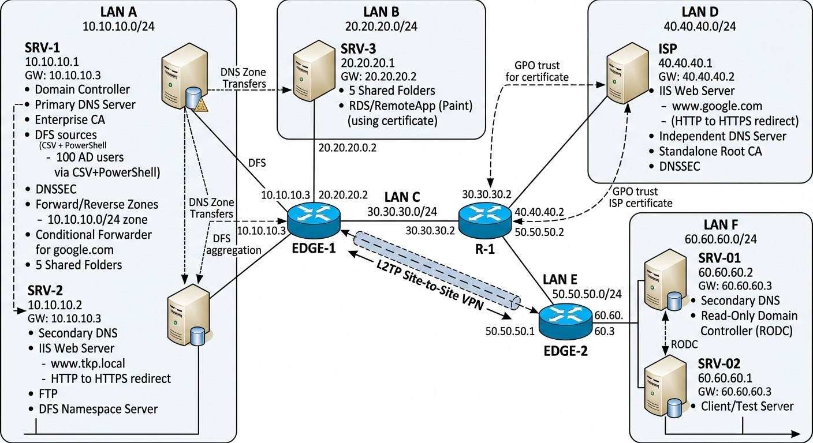

# 01 — Network Design

## Overview

This document describes the complete network topology, IP addressing plan, and routing design for the TKP infrastructure lab. The environment simulates a two-site organization (Headquarters and Branch) connected through a central routing layer and a simulated upstream/ISP network.

The design goal was to represent a realistic multi-site enterprise network — with distinct broadcast domains, deliberate routing boundaries, and a controlled, directional trust relationship with the upstream provider — rather than a single flat lab network.

---

## Topology Summary

The environment is built from seven routed segments (LAN A through LAN F, referred to below by letter) connecting nine hosts across three routers.

| Segment | Network | Connects |
|---|---|---|
| LAN A | `10.10.10.0/24` | SRV-1, SRV-2 ↔ EDGE-1 |
| LAN B | `20.20.20.0/24` | SRV-3 ↔ EDGE-1 |
| LAN C | `30.30.30.0/24` | EDGE-1 ↔ R-1 |
| LAN D | `40.40.40.0/24` | ISP ↔ R-1 |
| LAN E | `50.50.50.0/24` | R-1 ↔ EDGE-2 |
| LAN F | `60.60.60.0/24` | SRV-01, SRV-02 ↔ EDGE-2 |

`R-1` sits at the center of the topology and only routes traffic between LAN C, LAN D, and LAN E — it does not host any application services. `EDGE-1` and `EDGE-2` are the boundary routers for the Headquarters and Branch sites respectively, and are also the endpoints of the site-to-site VPN tunnel (see [07-site-to-site-vpn.md](07-site-to-site-vpn.md)).



---

## IP Addressing Table

| Host | Segment | IP Address | Default Gateway | DNS (Primary) | DNS (Secondary) |
|---|---|---|---|---|---|
| SRV-1 | LAN A | `10.10.10.1` | `10.10.10.3` | `10.10.10.1` | `10.10.10.2` |
| SRV-2 | LAN A | `10.10.10.2` | `10.10.10.3` | `10.10.10.2` | `10.10.10.1` |
| SRV-3 | LAN B | `20.20.20.1` | `20.20.20.2` | `10.10.10.1` | `10.10.10.2` |
| EDGE-1 | LAN A / LAN B / LAN C | `10.10.10.3` / `20.20.20.2` / `30.30.30.1` | `30.30.30.2` (via LAN C, to R-1) | — | — |
| R-1 | LAN C / LAN D / LAN E | `30.30.30.2` / `40.40.40.2` / `50.50.50.2` | — (core router, routing only) | — | — |
| ISP | LAN D | `40.40.40.1` | `40.40.40.2` | `40.40.40.1` | — |
| EDGE-2 | LAN E / LAN F | `50.50.50.1` / `60.60.60.3` | `50.50.50.2` (via LAN E, to R-1) | — | — |
| SRV-01 | LAN F | `60.60.60.2` | `60.60.60.3` | `60.60.60.2` | `10.10.10.1` |
| SRV-02 | LAN F | `60.60.60.1` | `60.60.60.3` | `10.10.10.1` | `10.10.10.2` |

---

## Routing Design

### Default Gateway Chain

Every host's default gateway points toward the router local to its own segment; there is no static routing configured on the end servers themselves. The path between any two segments is resolved hop-by-hop through the router chain:

```
SRV-1 / SRV-2 / SRV-3 → EDGE-1 → R-1 → EDGE-2 → SRV-01 / SRV-02
                                   ↓
                                  ISP
```

### Why R-1 Is a Pure Router

`R-1` was deliberately kept free of any application services and configured only for inter-segment routing (LAN C ↔ LAN D ↔ LAN E). This reflects a common real-world design principle: the core/backbone routing layer should be a stable, minimal-attack-surface component, separate from the edge devices that handle NAT, VPN termination, and policy enforcement. Placing services on `R-1` would blur that boundary and make the core layer a bigger blast radius if compromised.

### Why NAT/PAT Lives on the Edge Routers, Not on R-1

NAT/PAT is implemented on `EDGE-1` (and used as part of the site-to-site VPN path to `EDGE-2`), not on `R-1`. Edge routers are the natural place for NAT because they sit at the actual trust boundary of each site — where internal, site-specific addressing meets the shared inter-site/upstream path. Keeping `R-1` NAT-free keeps its routing table and behavior simple and predictable, and keeps address-translation policy local to the site that owns it.

---

## Segment-by-Segment Design Notes

**LAN A (`10.10.10.0/24`) — Headquarters core**
Hosts the primary identity and DNS services (SRV-1) and the web/file/DNS secondary (SRV-2). Both servers share `EDGE-1` as their gateway.

**LAN B (`20.20.20.0/24`) — Headquarters secondary segment**
Isolates SRV-3 (file services, RemoteApp) onto its own broadcast domain rather than placing it on LAN A, so that RDS/RemoteApp traffic and file-service traffic are segmented from the AD DS/DNS core.

**LAN C (`30.30.30.0/24`) — Headquarters-to-core link**
A dedicated point-to-point-style segment between `EDGE-1` and `R-1`, used purely for routing — no hosts live here beyond the two router interfaces.

**LAN D (`40.40.40.0/24`) — Upstream/ISP link**
Connects the simulated ISP host to `R-1`. This segment is where the directional trust boundary is enforced (see [08-security-controls.md](08-security-controls.md)): traffic can flow from the internal networks toward the ISP, but not the reverse.

**LAN E (`50.50.50.0/24`) — Core-to-Branch link**
Mirrors LAN C's role, but for the Branch side — a routing-only segment between `R-1` and `EDGE-2`.

**LAN F (`60.60.60.0/24`) — Branch segment**
Hosts the Branch's RODC/secondary DNS server (SRV-01) and the client/test host (SRV-02), both gatewayed through `EDGE-2`.

---

## Verification

Basic reachability across the topology was validated with `ping` and `tracert`/`Test-NetConnection` from representative hosts on each segment, confirming:

- End-to-end connectivity between Headquarters and Branch hosts across the full router chain.
- Correct hop-by-hop path through `EDGE-1 → R-1 → EDGE-2`.
- The ISP segment's directional isolation (see [08-security-controls.md](08-security-controls.md) for the full test and rule set).

---

## Related Documents

- [03-dns-architecture.md](03-dns-architecture.md) — DNS role placement across these segments
- [07-site-to-site-vpn.md](07-site-to-site-vpn.md) — VPN tunnel between EDGE-1 and EDGE-2, and NAT/PAT detail
- [08-security-controls.md](08-security-controls.md) — ISP boundary enforcement
